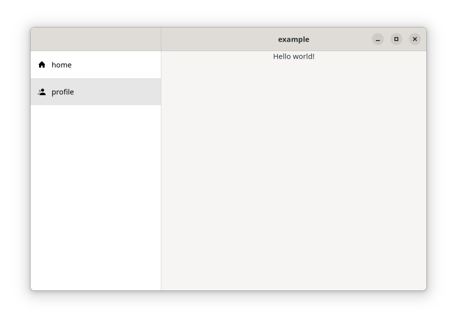
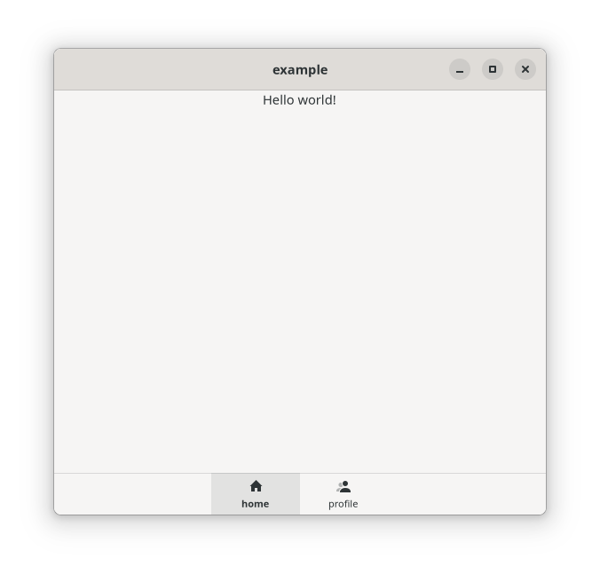

# Rust GTK App Framework

[](https://gitlab.com/loers/gtk-rust-app/-/commits/main)
[](https://docs.rs/gtk-rust-app)


*(Yes that's the icon)*

This libaray aims to provide a framework for adaptive GTK4 and libadwaita apps written in Rust.

Writing flatpak apps requires several files (.desktop file, appdata.xml, flatpak manifest). gtk-rust-app and its CLI [`gra`](https://gitlab.com/loers/cargo-gra) allow to generate these files based on an extended Cargo.toml.

## Getting started

Creating apps with gtk-rust-app requires to
1. Add more metadata to the Cargo.toml
2. Write some boilerplate code in main.rs
3. Define App pages
4. Optional: Define a build.rs script
5. Install cargo-gra subcommand

### Cargo.toml

Define app metadata and the dependency to `gtk-rust-app` in your Cargo.toml (see [Manifest](docs/Manifest.md) for more information):

```toml
# Cargo.toml

[package]
...

[app]
# Metadata of your app

[settings]
# global settings

[actions]
# global GTK actions

[dependencies]

# as usual

gtk-rust-app = { git = "https://gitlab.com/loers/gtk-rust-app.git", features = [ "ui" ] }

# If you want to automatically update generated files you can add this build dependency
[build-dependencies]
gtk-rust-app = { git = "https://gitlab.com/loers/gtk-rust-app.git", features = [ "build" ] }

```

### App boilerplate code

Create the file main.rs:

```rust
// src/main.rs
#[macro_use]
extern crate gtk_rust_app;
#[macro_use]
extern crate log;

use gettextrs::gettext;
use gtk::prelude::*;

// This module will contain our home page
mod home;

fn main() {
    env_logger::init();

    info!("{}", gettext("Check po/ dir for translations."));

    // Call app builder with metadata from your Cargo.toml and the 
    // gresource file compiled by the `gtk_rust_app::build` script (see below).
    gtk_rust_app::builder::builder(
        include_bytes!("../Cargo.toml"),
        include_bytes!("../target/gra-gen/compiled.gresource"),
    )
    // include your style sheets here
    .styles(include_str!("styles.css"))
    .build(
        |application, _project_descriptor, settings| {
            // Define all navigatable pages of the app
            let pages = vec![gtk_rust_app::ui::components::Page::new(
                home::home(),
                "home",
                Some((gettext("Home"), "go-home-symbolic".into())),
            )];

            // The pages will be placed in this predefined adaptive layout.
            let leaflet_layout = gtk_rust_app::ui::components::leaflet_layout(
                settings,
                Vec::new(),
                Vec::new(),
                pages,
            );
            // and we use the leaflet layout as root content in the apps window.
            let window = gtk_rust_app::ui::window(
                application,
                gettext("Example"),
                settings,
                leaflet_layout.leaflet.upcast_ref(),
            );
            window.show();
        },
        |app, _project_descriptor, _settings| {
            if let Some(action) = app.lookup_action("quit") {
                let simple_action: gdk4::gio::SimpleAction = action.downcast().unwrap();
                simple_action.connect_activate(glib::clone!(@weak app => move |_, _| {
                    app.quit();
                }));
            }
        },
    );
}
```

### Define app pages

The home page:
```rust
//src/home.rs

use gtk::prelude::*;

// Define a UI component with a function
pub fn home() -> gtk::Widget {
    // The interface macro allows to define your UI with the common gtk ui XML structures.
    interface!(r#"
        <object class="GtkBox" id="page">
            <property name="visible">True</property>
            <property name="orientation">vertical</property>
            <property name="spacing">16</property>

            <child>
            <object class="GtkLabel" id="label">
                <property name="label">gettext("Home page")</property>
            </object>
            </child>
            
            <child>
            <object class="GtkButton" id="button">
                <property name="visible">True</property>
                <property name="label">gettext("Press me")</property>
            </object>
            </child>

        </object>
    "#
        // Each widget which has an id can be retrieved here as a variable.
        page: gtk::Box,
        label: gtk::Label,
        button: gtk::Button,
    );

    println!("Do stuff with the widgets: {:?} {:?}", label, button);

    page.upcast()
}

```

### Optional: Build script

Define the build script:

```rust
// build.rs

pub fn main() {
    println!("cargo:rerun-if-changed=build.rs");
    println!("cargo:rerun-if-changed=Cargo.toml");
    println!("cargo:rerun-if-changed=src");
    println!("cargo:rerun-if-changed=assets");
    println!("cargo:rerun-if-changed=po");
    gtk_app_framework::build(None);
}
```

### Install cargo-gra

```
cargo install cargo-gra 

```

Prepare the app build via:

```
cargo gra setup
```

and build it as usual:

```
cargo build --release
```

You can build a flatpak app via:

```
cargo gra flatpak
```

That's it. You will see an app like this:



The app has adaptive behaviour per default.



## Run with different language

```sh
LANGUAGE="de_DE:de" LANG="de_DE.utf8" TEXT_DOMAIN="target" cargo run
```

## Build

```sh
# build your binary release
cargo build --release
# create a flatpak
make -C out flat
```

## Requirements

Debian dependencies:

```
sudo apt install libgraphene-1.0-dev libgtk-4-dev flatpak-builder
```

Arch dependencies:
```
pacman
```

To build a flatpak you need the to install gnome-nightly remote. Download https://nightly.gnome.org/gnome-nightly.flatpakrepo.

```sh
flatpak remote-add --if-not-exists gnome-nightly gnome-nightly.flatpakrepo
```

```sh
flatpak install org.gnome.Sdk//master
flatpak install org.gnome.Platform//master
flatpak install org.freedesktop.Sdk.Extension.rust-stable//21.08
```

