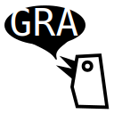

# Rust GTK App Framework

[](https://gitlab.com/loers/gtk-rust-app/-/commits/main)
[](https://docs.rs/gtk-rust-app)
[](https://crates.io/crates/gtk-rust-app)



This libaray aims to provide a framework for adaptive GTK4 and libadwaita apps written in Rust.

Writing flatpak apps requires several files (.desktop file, appdata.xml, flatpak manifest). gtk-rust-app and its CLI [`gra`](https://gitlab.com/loers/cargo-gra) allow to generate these files based on an extended Cargo.toml.

## Getting started TLDR

```
cargo install cargo-generate
cargo generate --git https://gitlab.com/loers/gtk-rust-app.git
cd <your app>
sudo make install-gsettings
cargo run
```

## Getting started

Creating apps with gtk-rust-app requires to
1. Add more metadata to the Cargo.toml
2. Write some boilerplate code in main.rs
3. Define App pages
4. Optional: Define a build.rs script
5. Install cargo-gra subcommand
6. Install app settings locally

### Cargo.toml

Define app metadata and the dependency to `gtk-rust-app` in your Cargo.toml. [Checkout the manifest reference](docs/ManifestReference.md) for more info.

```toml
# Cargo.toml

[package]
...

[app]
# Metadata of your app

[settings]
# global settings

[actions]
# global GTK actions

[dependencies]

# as usual

gtk-rust-app = { git = "https://gitlab.com/loers/gtk-rust-app.git", features = [ "ui" ] }

# If you want to automatically update generated files you can add this build dependency
[build-dependencies]
cargo-gra = "0.3"


```

### App boilerplate code

Create the file main.rs:

```rust
// src/main.rs

#[macro_use]
extern crate gtk_rust_app;
#[macro_use]
extern crate log;

use gettextrs::gettext;
use gtk::prelude::*;
use gtk_rust_app::widgets::LeafletLayout;

use crate::home::Home;

// This module will contain our home page
mod card;
mod home;

fn main() {
    env_logger::init();

    info!("{}", gettext("Check po/ dir for translations."));

    // call app builder with metadata from your Cargo.toml and the gresource file compiled by the `gtk_rust_app::build` script (see below).
    gtk_rust_app::builder::builder(
        include_bytes!("../Cargo.toml"),
        include_bytes!("../target/gra-gen/compiled.gresource"),
    )
    // include your style sheets here
    .styles(include_str!("styles.css"))
    .build(
        |application, _project_descriptor, settings| {
            // setup custom types
            card::Card::static_type();

            // The pages will be placed in this predefined adaptive layout.
            let leaflet_layout = LeafletLayout::builder(settings)
                .add_page(Home::new())
                .build();

            // LeafletLayout contains a toast overlay
            leaflet_layout.show_message("Hello world");

            // and we use the leaflet layout as root content in the apps window.
            let window = gtk_rust_app::window(
                application,
                gettext("Example"),
                settings,
                leaflet_layout.upcast_ref(),
            );
            window.show();
        },
        |app, _project_descriptor, _settings| {
            if let Some(action) = app.lookup_action("quit") {
                let simple_action: gdk4::gio::SimpleAction = action.downcast().unwrap();
                simple_action.connect_activate(glib::clone!(@weak app => move |_, _| {
                    app.quit();
                }));
            }
        },
    );
}
```

### Define app pages

The home page:
```rust
//src/home.rs

use gdk4::subclass::prelude::ObjectSubclassIsExt;
use gtk::prelude::*;
use gettextrs::gettext;
use crate::card::Card;

// Define a page of your app as a new widget
#[widget(gtk::Box)]
#[template(file = "home.ui")]
struct Home {
    #[template_child]
    pub card: TemplateChild<Card>,
}

impl Home {
    pub fn constructed(&self) {
        self.imp().card.connect_card_clicked(|card| {
            println!("Text prop: {:?}", card.text());
        });
    }

    pub fn new() -> Home {
        glib::Object::new(&[]).expect("Failed to create Home")
    }
}

impl gtk_rust_app::widgets::Page for Home {
    fn name(&self) -> &'static str {
        "home"
    }

    fn title_and_icon(&self) -> Option<(String, String)> {
        Some((gettext("Home"), "go-home-symbolic".into()))
    }
}
```

```xml
// home.ui
<?xml version="1.0" encoding="UTF-8"?>
<interface>
  <template class="Home" parent="GtkBox">
    <property name="hexpand">True</property>
    <property name="vexpand">True</property>
    <property name="orientation">vertical</property>
    <style>
      <class name="home" />
    </style>

    <child>
      <object class="Card" id="card"></object>
    </child>

  </template>
</interface>
```

### Write your custom widgets

The examples above mention a `card` module. You can come up with your own idea (it works like the home page) or look into `examples/simple/src/card.rs`.

### Optional: Build script

Define the build script:

```rust
// build.rs
pub fn main() {
    println!("cargo:rerun-if-changed=build.rs");
    println!("cargo:rerun-if-changed=Cargo.toml");
    println!("cargo:rerun-if-changed=src");
    println!("cargo:rerun-if-changed=assets");
    println!("cargo:rerun-if-changed=po");
    gra::build(None, None);
}
```

### Install cargo-gra

```
cargo install cargo-gra 

```

Prepare the app build via:

```
cargo gra gen
```

and build it as usual:

```
cargo build --release
```

You can build a flatpak app via:

```
cargo gra flatpak
```

That's it. You will see an app like this:


The app has adaptive behaviour per default.


#### Install app settings locally

GTK apps define their settings and need gnome or phosh to have these settings installed globally. When you want to run your app without having these settings installed it will crash with an error.

Add the following `Makefile` to your project:
```
install-gsettings:
	install -D target/gra-gen/{{app-id}}.gschema.xml /usr/share/glib-2.0/schemas/{{app-id}}.gschema.xml
	glib-compile-schemas /usr/share/glib-2.0/schemas

uninstall-gsettings:
	rm /usr/share/glib-2.0/schemas/{{app-id}}.gschema.xml
	glib-compile-schemas /usr/share/glib-2.0/schemas
```

And replace `{{app-id}}` with your app id. Then run `make install-gsettings` and your app should run fine.

## Run with different language

```sh
LANGUAGE="de_DE:de" LANG="de_DE.utf8" TEXT_DOMAIN="target" cargo run
```

## Requirements

Debian dependencies:

```
sudo apt install libgraphene-1.0-dev libgtk-4-dev flatpak-builder
```

Arch dependencies:
```
TODO
```

To build a flatpak you need the to install gnome-nightly remote. Download https://nightly.gnome.org/gnome-nightly.flatpakrepo.

```sh
flatpak remote-add --if-not-exists gnome-nightly gnome-nightly.flatpakrepo
```

```sh
flatpak install org.gnome.Sdk//master
flatpak install org.gnome.Platform//master
flatpak install org.freedesktop.Sdk.Extension.rust-stable//21.08
```

## Examples

Checkout the example apps in [carg-gra](https://gitlab.com/loers/cargo-gra/-/tree/refactor-build-tooling-from-gtk-rust-app/examples).

## Writing custom Widgets

The example above already showed a custom GTK widget. The `#[widget]` macro makes it easy and fast to create custom widgets but it abstracts and simplifies some aspects. The GTK Rust book is a good source to understand what the `#[widget]` macro does and how to create custom widgets with full control.

https://gtk-rs.org/gtk4-rs/stable/latest/book/introduction.html

## Domain model and GObjects

Sometimes we need GObjects. Widgets are special GObjects. Similar to the `#[widget]` macro gtk-rust-app allows to define GObejcts quickly with the `#[gobject]` macro. An Example:

We have a domain struct `TodoItem`. Our application state stores these `TodoItems` in a vec and we want to select a single one in a GTK combobox (Or more likely in a `AdwComboRow`) menu. GTK expects a combobox to have a backing `model` which is a list of `GObjects`. Writing a GObject for our `TodoItem` is a lot of boilerplate code and we might not need the whole *objectiveness* because we are not writing object oriented code. Nevertheless we want our combobox to show the possible `TodoItems` and select one probably knowing the selected Id.

To address this problem `gtk-rust-app` provides the attribute macro `gobjectify`. The macro allows to define a set of fields for a struct which will be used to generate a GObject definition.

```rust
#[gobject(id, name)]
struct TodoItem {
    id: String,
    name: String,
    text: String,
}
```

Will generate the GObject `TodoItemGObject` with the properties `id` and `name` and a public method `TodoItem.gobjectify() -> TodoItemGObject`.

